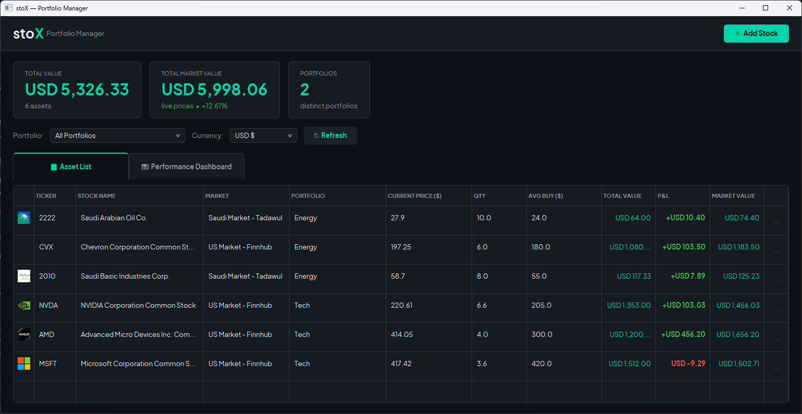
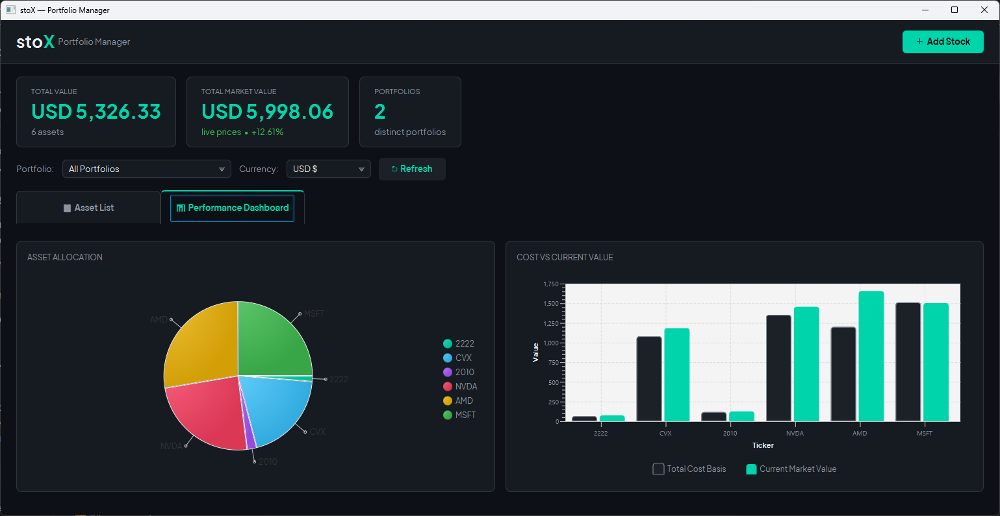
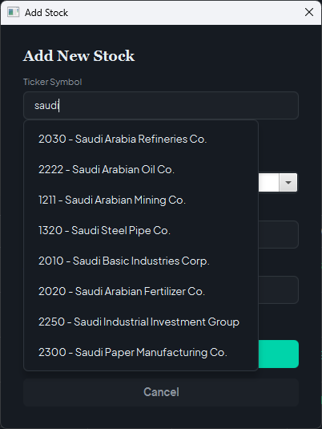

# stoX: Stocks Portfolio Manager
<p align="center">
  
</p>

## Description
A desktop application designed to solve the fragmentation of asset tracking for modern investors.
By unifying live market data from both the US market and the Saudi Exchange (Tadawul), stoX provides a
single, cohesive dashboard to track holdings, organize portfolios hierarchically, and view real-time
lifetime profit/loss. 


## Features

### ✅ Implemented Features (Completed)
* **Project & Database Setup:** Core project structure initialized with embedded SQLite database integration and SQL queries for local data persistence. [#1](https://github.com/cpit252-spring-26-IT1/project-stox-1/issues/1) & [#2](https://github.com/cpit252-spring-26-IT1/project-stox-1/issues/2)
* **Core Architecture:** Implementation of the core application logic, including the integration of Creational Design Patterns. [#2](https://github.com/cpit252-spring-26-IT1/project-stox-1/issues/2) & [#3](https://github.com/cpit252-spring-26-IT1/project-stox-1/issues/3)
* **Composite Design Pattern:** The system uniformly calculates the value of individual stocks and entire grouped portfolios using the Composite structural pattern. [#4](https://github.com/cpit252-spring-26-IT1/project-stox-1/issues/4)
* **Interactive Dashboard:** A custom-styled JavaFX UI form allowing users to dynamically add, view, and remove stock assets. [#5](https://github.com/cpit252-spring-26-IT1/project-stox-1/issues/5)
* **API Market Integration:** Connecting to live market APIs (e.g., Finnhub/Sahmk) to fetch real-time stock prices. [#6](https://github.com/cpit252-spring-26-IT1/project-stox-1/issues/6)
* **API Data Caching & Optimization:** Building a caching mechanism and timeout handler has been deferred. Because live API fetches are not yet active in this stage, caching is currently out of scope and will be implemented in a future release. [#8](https://github.com/cpit252-spring-26-IT1/project-stox-1/issues/8)
* **Profit/Loss Tracking:** Automated calculation and display of portfolio performance over time. [#9](https://github.com/cpit252-spring-26-IT1/project-stox-1/issues/9)
* **Currency Conversion Support:** Multi-currency portfolio viewing (e.g., SAR & USD). [#14](https://github.com/cpit252-spring-26-IT1/project-stox-1/issues/14)
* **Fractional Stock Shares Support:** Allow decimal value modification into stock entry logic (e.g., 0.5 shares). [#12](https://github.com/cpit252-spring-26-IT1/project-stox-1/issues/12)
* **Unit test implementation** [#10](https://github.com/cpit252-spring-26-IT1/project-stox-1/issues/10)
* **Stocks Branding (Logos):** Display stock brand logos alongside their respective ticker symbols. [#13](https://github.com/cpit252-spring-26-IT1/project-stox-1/issues/13)
* **Search bar for stocks suggestion:** Suggests stock symbols and company names as the user types. [#15](https://github.com/cpit252-spring-26-IT1/project-stox-1/issues/15)
* **UI Improvements:** [#11](https://github.com/cpit252-spring-26-IT1/project-stox-1/issues/11)
  * Replace the application interface font for eye appealing reading.
  * Implement interactive charts and graphs to visualize portfolio performance.

## 🛠️ Prerequisites
### To run this project, you must have the following installed:
* **Java 17 or 21** (JDK)
* **Apache Maven**

### API **keys** from:
* [Finnhub](https://finnhub.io/) API for US market.
* [Sahmk](https://www.sahmk.sa/developers) API for Saudi Tadawul market.

## Usage

### To build and run the app, use:

- **Option 1: Run directly via Maven**
  - Open the terminal run the following command:
```bash
mvn clean javafx:run
```

- **Option 2: Build and run the executable Fat JAR**
  - Open the terminal run the following command:
```bash
mvn clean package
```

```bash
cd target
java -jar course-project-1.0-SNAPSHOT.jar
```

### Create a `.env` file, and place the project source code or the compiled `.jar` and the `.env` file in the same root folder:

Example:
```bash
my_folder/
 ├── stoX.jar
 └── .env
```

`.env` file format:
```bash
FINNHUB_API_KEY={place your Finnhub API key here}
SAHMK_API_KEY={place your Sahmk API key here}
```
## Screenshots





## 🤖 Generative AI Disclosure

In alignment with academic integrity guidelines, this section discloses the utilization of Generative AI tools (Gemini, Google Antigraviy) during the design, implementation, and testing phases of the **stoX** application.

### Tasks Assisted by Generative AI

1. **Stock Brand Logos Display**:
   - Assistance with creating the [LogoService.java](src/main/java/sa/edu/kau/fcit/cpit252/project/api/LogoService.java) model which handles downloading brand logos from [eodhd.com](eodhd.com) and [www.tadawulgroup.sa](www.tadawulgroup.sa) using a browser-like `User-Agent` and caching them inside a `ConcurrentHashMap`.
   - Modifying the table cell factory inside [MainView.java](src/main/java/sa/edu/kau/fcit/cpit252/project/ui/MainView.java) to load logo images dynamically in the background next to ticker symbols.

2. **Autocomplete Suggestions Engine**:
   - Design of the suggestion model [StockSuggestion.java](src/main/java/sa/edu/kau/fcit/cpit252/project/model/StockSuggestion.java) and loading service [StockSuggestionService.java](src/main/java/sa/edu/kau/fcit/cpit252/project/api/StockSuggestionService.java) to parse large stock datasets asynchronously.
   - Creating a dark-themed visual suggestions popup (`ContextMenu` overlay) under the Ticker Symbol input with interactive mouse-hover animations.
   - Implementation of suggestion testing in [StockSuggestionServiceTest.java](src/main/java/sa/edu/kau/fcit/cpit252/project/api/StockSuggestionServiceTest.java) to verify async loading, case insensitivity, ranked matching, and Tadawul code mapping.

3. **Frontend UI Redesign & Performance Dashboard**:
   - Styling the entire JavaFX application using custom CSS in [styles.css](src/main/resources/styles.css) paired with the premium **Plus Jakarta Sans** font.
   - Restructuring the main screen layout to feature a clean `TabPane` divided into **Asset List** and **Performance Dashboard**.
   - Creating the interactive **Asset Allocation Pie Chart** (with scaling slices and allocation tooltips) and **Cost vs. Market Value Bar Chart** (with color-coded comparisons).
   - Building the automated JavaFX TestFX UI integration test suite in [MainViewJavaFxTest.java](src/test/java/sa/edu/kau/fcit/cpit252/project/ui/MainViewJavaFxTest.java) to verify views, selections, deletes, currency conversion rates, and profit/loss display states.

---

### Human Role, Control & Oversight

While Generative AI served as an accelerator for syntax generation, visual layouts, and boilerplate code:
* **Architecture & Patterns Design**: The core structural planning remains entirely human. Developers designed and implemented the **Composite Pattern** (via [PortfolioComponent.java](src/main/java/sa/edu/kau/fcit/cpit252/project/model/PortfolioComponent.java), [Portfolio.java](src/main/java/sa/edu/kau/fcit/cpit252/project/model/Portfolio.java), and [Stock.java](src/main/java/sa/edu/kau/fcit/cpit252/project/model/Stock.java)), the DAO structure ([SqliteStockDAO.java](src/main/java/sa/edu/kau/fcit/cpit252/project/dao/SqliteStockDAO.java)), and the Singleton connection pattern in [DatabaseConnection.java](src/main/java/sa/edu/kau/fcit/cpit252/project/db/DatabaseConnection.java).
* **Dataset Optimization**: Developers identified that the Saudi market stock database contained nearly 600,000 blank trailing records due to an Excel export formatting issue. The dataset was manually trimmed and cleaned, shrinking the file size from **4.7 MB to 12 KB** to optimize application startup and build size.
* **Review, Debugging & Integration**: Every AI-suggested implementation plan, CSS stylesheet rule, and TestFX test was reviewed, modified to fix layout bugs, and verified against local Java 17/21 Maven environments.
* **API Configurations**: Defined and configured credentials, retry policies, and caches for Tadawul and Finnhub APIs using environment-variable loaders.

---

## License
This project is licensed under the MIT License. See the [LICENSE](LICENSE) file for details.
